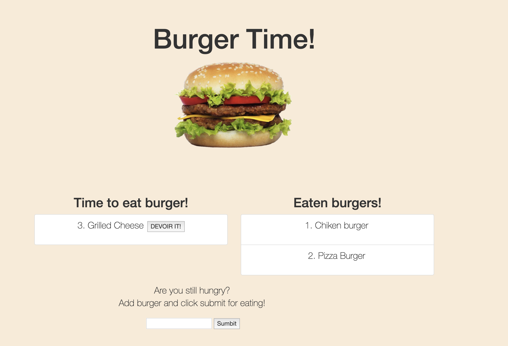

# Burger

## Live link

https://secure-cove-79588.herokuapp.com/

## How to use 

* is a restaurant app that lets users input the names of burgers they'd like to eat.
* Whenever a user submits a burger's name, your app will display the burger on the left side of the page -- waiting to be devoured.
* Each burger in the waiting area also has a Devour it! button. When the user clicks it, the burger will move to the right side of the page.
* Each burger in the waiting area also has a Devour it! button. When the user clicks it, the burger will move to the right side of the page.

## Screen

## Using

* JavaScript
* NodeJS
* MySQL
* NPM 
    * mysql
    * express-handlebars
    * path

## Author

* **Arman Bareyan** [ABareyan](https://github.com/ABareyan)

## License

No license agreements. 
